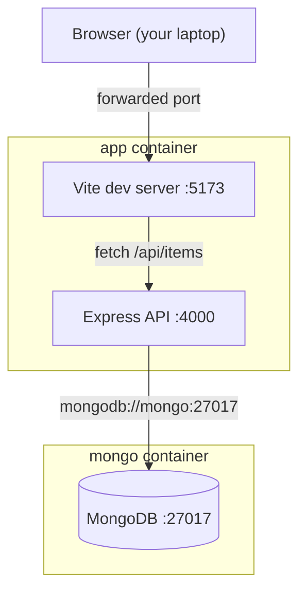

# Architecture

## The shape of it

This diagram is text. It renders here and on GitHub, and a change to it appears in a pull
request as a readable one-line diff rather than `Binary files differ`. That is the whole
reason it is not a screenshot.

## Why two containers

The database is a genuinely separate process with its own lifecycle and its own storage.
Running it beside the application, rather than inside it, means the application container
can be destroyed and rebuilt without losing data, and the data volume can be dropped
deliberately when a clean slate is wanted.

The `app` container is a workshop, not a shipping unit. It runs `sleep infinity` and waits
for you to work inside it. Packaging a production image is a different concern entirely,
and this repository does not attempt it.

## Why service names instead of addresses

The API connects to `mongodb://mongo:27017`. `mongo` is the Docker Compose service name,
resolved on the shared container network.

Container IP addresses change on every restart, so hardcoding one guarantees a failure on
the next `docker compose up`. The service name is stable for as long as the compose file
says it is.

The same code runs outside a container by pointing `MONGO_URL` at `localhost` — a
configuration change, not a code change.

## Why validation happens at the boundary

Request input is untrusted. `normalizeName` and `parseItemId` in
`src/server/src/validate.js` accept a value only in the exact shape expected, and return
`null` for everything else.

Rejecting `{ $ne: null }` matters as much as rejecting an empty string: an object arriving
where a string was expected is what a query-injection attempt looks like. Checking shape
before the value reaches a database query is what stops it, and it is why
`DELETE /api/items/:id` answers `400` without querying anything.

## Why configuration lives outside the code

Anything that differs between machines, environments or runs is a setting, not a constant.
Port, connection string and log verbosity all vary; the code reads them once, in one
place, with a sensible default.

The test of whether this is working: changing behaviour should leave `git status` clean.

## Why the environment is in the repository

See [ADR 0001](../adr/0001-use-dev-containers.md).
